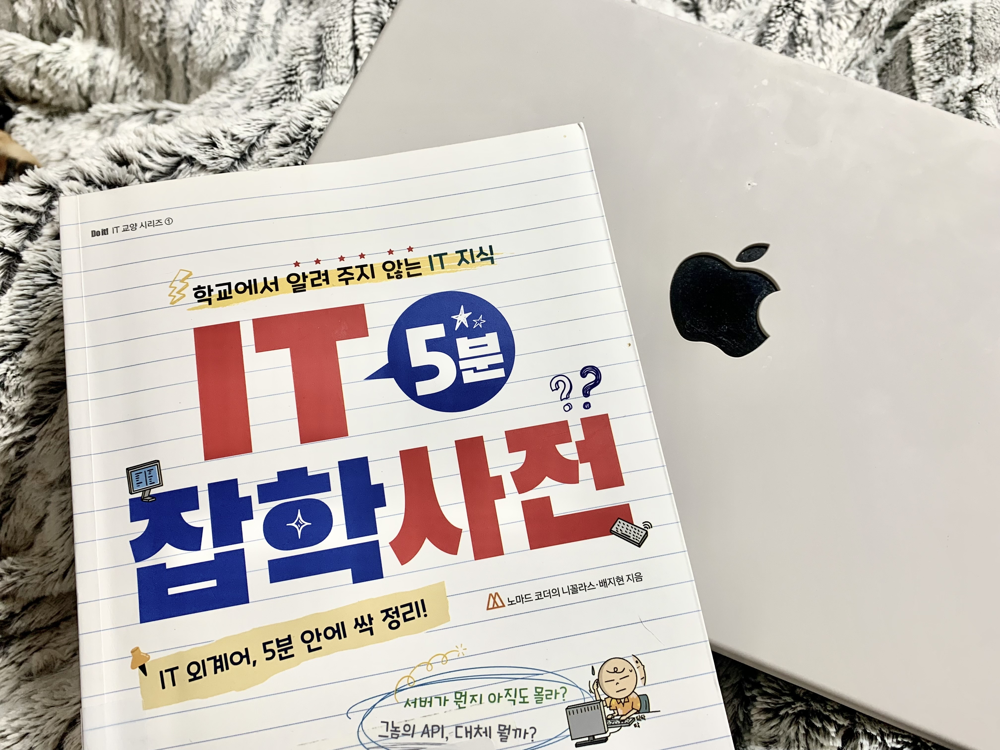

# 📚 IT 5분 잡학사전
> 노마드코더 개발자 북클럽 참여 (2023.01.13 ~ 2023.01.26)

## 진행방법
'IT 5분 잡학사전'을 2주 동안 완독 
매일 읽고 TIL 작성 

## Assignment #01 책 인증

<pre>#코딩 #개발자 #노마드북클럽 #노개북</pre>

## TIL 목차
* <a href="assignment-02.md">Assignment #02 </a>
  * ep.1 ~ ep.5
* Assignment #03
  * ep.6 ~ ep.10
* Assignment #04
  * 퀴즈 Quiz (1)
* Assignment #05
  * ep.11 ~ ep.15
* Assignment #06
  * ep.16 ~ ep.21
* Assignment #07
  * ep.22 ~ ep.25
* Assignment #08
  * 퀴즈 Quiz (2)
* Assignment #09
  * ep.26 ~ ep.29
* Assignment #10
  * ep.30 ~ ep.34
* Assignment #11
  * 미션 Mission (1)
* Assignment #12
  * ep.35 ~ ep.38
* Assignment #13
  * ep.39 ~ ep.45
* Assignment #14
  * 미션 Final Mission (2)